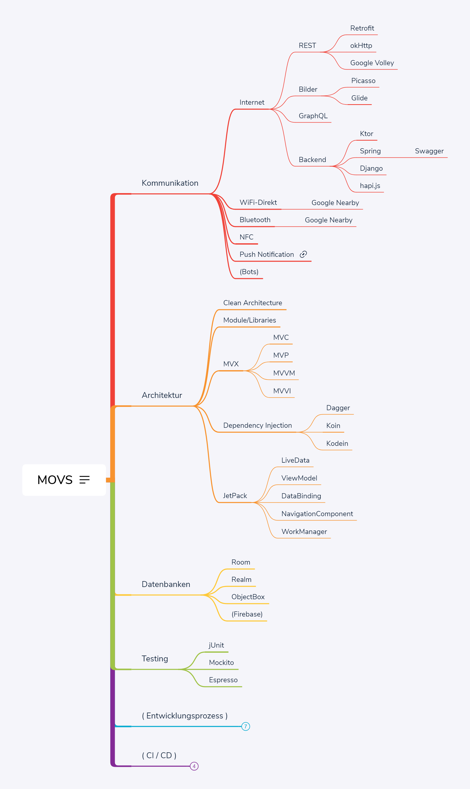

# Vorlesung MOVS

Dies sind die Unterlagen für die Vorlesung Mobile Verteilte Systeme (MOVS) an der [TH-Bingen](https://www.th-bingen.de/home/) für die Studiengänge [Mobile Computing](https://www.th-bingen.de/studium/studiengaenge/mobile-computing) und [Informatik](https://www.th-bingen.de/studium/studiengaenge/informatik). In diesem Fach ist ein [Projekt](Project.md) mit zugehöriger Projektpräsentation als Prüfungsleistung vorgesehen.

## Themen & Techniken der Vorlesung

